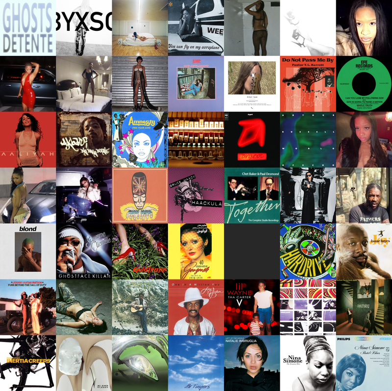

# scrobble-say

> Your Last.fm top albums in the terminal, rendered as image grids or
> currently-playing one-liners. A musical companion to cowsay for your shell
> greeting.

<p align="center">
  
</p>

Sister project to [scrobble-now](https://github.com/jeanluciradukunda/scrobble-now)
(macOS menu-bar app) — same data sources, terminal output.

## What it does

Two modes, both fed from your Last.fm history:

1. **Album grid** — fetches `user.gettopalbums`, downloads cover art (cached
   to disk), composes an NxM grid via Pillow, prints it via chafa. Pick
   stylised block-glyph rendering for speed (default) or raw inline-image
   rendering (iTerm2 / kitty / sixels) for pixel-perfect covers.

2. **Now playing** — one-line greeting from `user.getrecenttracks`:
   ```
   ♪ Babyxsosa — IDFWY · BABYBAEXSOSA           # currently playing
   ♫ Elysia Crampton — Reina  (4h ago)          # most recent scrobble
   ```

## Quick start

```bash
scrobble-say                          # default: 3x3, 7 days, pixel-perfect iTerm2 render
scrobble-say --period 1month          # last month
scrobble-say --grid 4x4               # 16 covers
scrobble-say --grid 10x2              # wide banner
scrobble-say --grid 1x9               # tall sidebar
scrobble-say --format symbols         # chafa stylised mode (fast, broad terminal support)
scrobble-say --position center        # centred in terminal
scrobble-say --position right         # right edge
scrobble-say --now                    # currently playing, one line
scrobble-say --json                   # raw album list, no render
scrobble-say --cache-info             # show cache sizes
scrobble-say --cache-clear            # nuke covers + api + tmp grid
```

The default render mode is `iterm` (raw inline image — pixel-perfect, iTerm2/
Wezterm/etc.). Use `--format symbols` for plain xterm/tmux compatibility or
when you want the faster chafa-stylised look. The cowsay-precmd snippet
below passes `--format symbols` explicitly so the per-shell greeting stays
snappy.

## Shell integration (cowsay rotation)

This pairs with a [cowsay](https://github.com/cowsay-org/cowsay) shell
greeting. Add to `~/.zshrc`:

```sh
export SCROBBLE_BOOST=20    # % of new terminals show albums instead of a cow
export SCROBBLE_SAY_BIN="$HOME/myspace/scrobble-say/bin/scrobble-say"
```

Then in your existing precmd that prints cowsay, roll first:

```sh
if (( SCROBBLE_BOOST > 0 )) && (( RANDOM % 100 < SCROBBLE_BOOST )) \
   && [[ -x $SCROBBLE_SAY_BIN ]]; then
  "$SCROBBLE_SAY_BIN" --format symbols --size 60x30 && return
fi
# … fall through to your cowsay code
```

A `scrobble` helper function makes it ergonomic at the prompt:

```sh
scrobble                  # show grid now
scrobble now              # currently playing
scrobble week | month | year | overall
scrobble boost 50         # 50% of new shells show scrobble
scrobble off              # disable
scrobble status           # show settings
```

(See [home/.zshrc](https://github.com/jeanluciradukunda/dotfiles/blob/main/home/.zshrc)
in my dotfiles for a full implementation that integrates with cowsay's own
fav/style/size knobs.)

## Install

```bash
brew install chafa gitleaks pre-commit
git clone git@github.com:jeanluciradukunda/scrobble-say ~/myspace/scrobble-say
cd ~/myspace/scrobble-say

# Python deps in a project-local venv
python3 -m venv venv
./venv/bin/pip install -r requirements.txt

# Install gitleaks pre-commit hook
pre-commit install

# Config
mkdir -p ~/.config/scrobble-say
cp config.example.toml ~/.config/scrobble-say/config.toml
# Edit ~/.config/scrobble-say/config.toml: set lastfm.username + op_item_id

# Make `scrobble-say` callable from anywhere
export PATH="$HOME/myspace/scrobble-say/bin:$PATH"   # add to ~/.zshrc
```

## Secrets

API keys live in **1Password**, never on disk in this repo. The default
config reads the Last.fm API key from 1Password at runtime via `op read`.
The 1Password item ID goes in `~/.config/scrobble-say/config.toml` (outside
the repo).

Prefer env vars? Set `secrets_source = "env"` in your config and export
`LASTFM_API_KEY` in your shell.

## Caching

| Path | What | Bound |
|---|---|---|
| `~/.cache/scrobble-say/api/` | Last.fm JSON, TTL'd | 24h freshness by default |
| `~/.cache/scrobble-say/covers/` | downloaded album cover PNGs | LRU-evicted at 50 MB (configurable) |
| `/tmp/scrobble-say-grid.png` | composed grid for chafa | one file, overwritten each call |

Tune in `~/.config/scrobble-say/config.toml`:
```toml
[cache]
ttl_seconds   = 86400   # API-response cache freshness; 0 = disabled
covers_max_mb = 50      # covers LRU cap; 0 = disabled
```

## Pre-commit / secret scanning

[gitleaks](https://github.com/gitleaks/gitleaks) runs on every `git commit`
via pre-commit. The ruleset extends gitleaks' upstream defaults with
Last.fm + Discogs patterns specific to this project (see `.gitleaks.toml`).

Run manually:

```bash
pre-commit run --all-files
gitleaks protect --staged --config .gitleaks.toml --verbose   # what the hook runs
gitleaks detect --config .gitleaks.toml --verbose             # scan git history
```

If you ever commit a real key by accident:
1. `git reset --soft HEAD~1` (uncommit)
2. Revoke the key at last.fm/api/account
3. Update 1Password with the new key
4. Re-commit

## Roadmap

| Phase | Scope | Status |
|---|---|---|
| 1 | Top-albums-grid image in terminal | ✅ |
| 2 | `--now` currently-playing one-liner | ✅ |
| 3 | `--now` watch-mode (polling refresh, useful as a tmux pane) | todo |
| 4 | Synced lyric line of currently-playing song via [LRClib](https://lrclib.net) | todo |
| 5 | Cowsay precmd rotation (`SCROBBLE_BOOST` knob, `scrobble` helper) | ✅ |

Open suggestions / collaborations in [issues](https://github.com/jeanluciradukunda/scrobble-say/issues)
— issue #1 is about Apple Music playback control via `osascript`.

## License

MIT — see [LICENSE](LICENSE).
